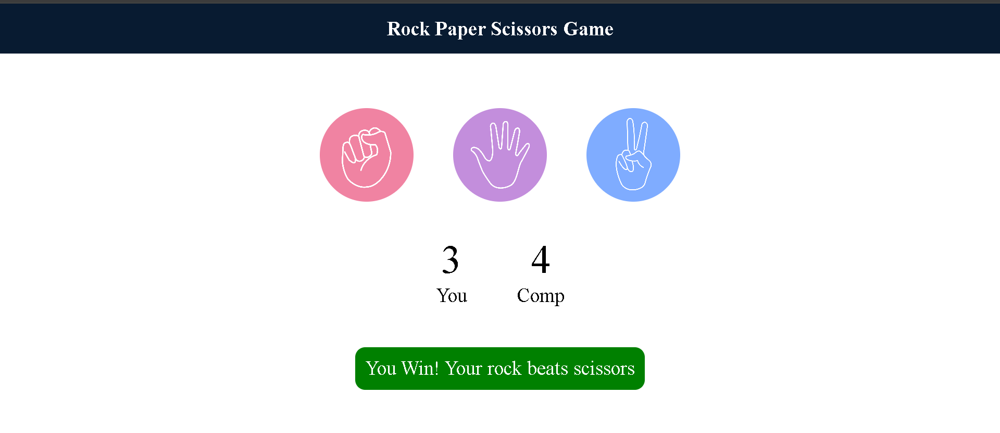

# Rock Paper Scissors Game

A fun and interactive Rock Paper Scissors game built using HTML, CSS, and JavaScript. This browser-based project lets users play against a computer opponent with real-time score tracking and smooth visual feedback.

[🔗 Live Demo](https://sahanahc123.github.io/RPS-Project/)

## 📌 Features

- 🎮 Play Rock, Paper, or Scissors with a single click
- 🧠 Computer randomly selects its move
- 📊 Real-time score updates for user and computer
- ✨ Visually highlights selected choices
- ✅ Displays clear result messages (win, lose, or draw)

## 🛠️ Tech Stack

- **HTML**
- **CSS**
- **JavaScript**

## 📸 Screenshot

[GitHub Repo] (https://github.com/sahanahc123/TicTacToe-Project)
Made with ❤️ by Sahana HC

